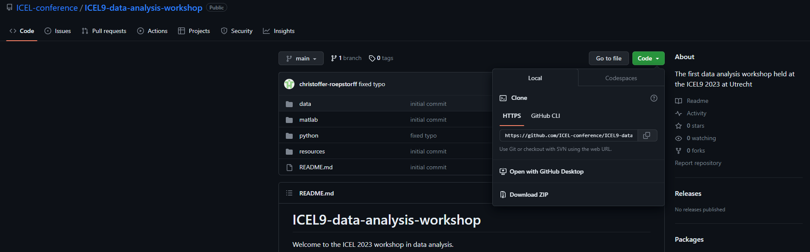

# ICEL9-data-analysis-workshop

Welcome to the ICEL 2023 workshop in data analysis. 

In this workshop we will showcase some examples of equine-kinematics analysis procedures using MATLAB and python. 
Hopefully this will present you with some insights into how this can be done, with some useful code-snippets and 
an attempt to present these comprehensible.

## Requirements

For the actual workshop you will need the following,
1. Your own laptop.

2. The proper software installed. Either MATLAB or Python. Installation guides for [MATLAB](./matlab/installation.md) and 
[Python](./python/installation.md) can be found in their respective folders in this repository.
3. Data sets downloaded. Here are the links for this.
4. Make sure the code in this repository is available and can be run on your laptop. If you are familiar with github
feel free to clone this repository. If you are unfamiliar with github you can download a zip file from this repos main 
page by clicking the green code button above to the right and then click 'Download ZIP' . Make sure you have selected 
the main branch, as seen above to the left of this page. Here is an image of what it should look like. 

