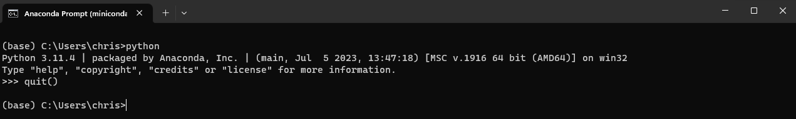

# Installation instructions for Python

This document will go through the installation process to get python up and running for this workshop. In addition to 
installing python, we will also install a commonly used package manager so that we can organize the non-standard library
packages that we are going to use. If this sounds confusing, do not worry too much, simply following the instructions 
will be fine.


## Install Miniconda
What is conda / Miniconda? Here is the description from the official documentation,
> Conda is an open-source package management system and environment management system that runs on Windows, macOS, and Linux

Miniconda is bare-bones distribution of both python and conda without any third party packages included in the installation.
So, by running the Miniconda installer we will, conveniently, install both python and the conda package manager. We will
install the third party packages ourselves to keep bloat and download size manageable.

Follow the instructions for downloading and installing the latest version of Miniconda for your preferred operating system
here, [Regular installation](https://conda.io/projects/conda/en/stable/user-guide/install/index.html#regular-installation)

## Test the python/conda installation
Once the installation is completed you should now be able to open an "Anaconda prompt" window. From the official 
documentation,

To open Anaconda Prompt:  
- Windows: Click Start, search for Anaconda Prompt, and click to open.
- macOS: Use Cmd+Space to open Spotlight Search and type “Navigator” to open the program.  
- Linux–CentOS: Open Applications > System Tools > terminal.  
- Linux–Ubuntu: Open the Dash by clicking the Ubuntu icon, then type “terminal”.

After opening Anaconda Prompt or the terminal, choose any of the following methods to verify:  
- Enter conda list. If everything is installed and working, this will display a list of installed packages and their versions.  
- Enter the command python. This command runs the Python shell, also known as the REPL. If everything is installed and working, 
the version information it displays when it starts up will include “Anaconda”. To exit the Python shell, enter the 
command quit().



## Creating an environment for our workshop
Python comes with what is called a [standard library](https://docs.python.org/3/library/index.html) which contains 
commands that let use write and execute code. However, doing certain things, as for example filtering a signal and 
plotting the results, is not always straight-forward using only the standard library. Luckily, python has a very rich ecosystem of 
third-party packages that can be installed separately and provide us with advanced functionalities.


Because both python and third party packages have versions that may or may not all be compatible with each other it is
considered good practice to isolate python and the packages you use on a project basis. This is typically called an 
environment, and we are going to create one for this workshop using our environment manager, conda. 
> **Note**  
> An environment is in essence just a folder containing specific versions of python and any third party packages you have 
> installed. You then choose to "activate" this environment before you run any code that will use the contained 
> versions of python and packages.

Begin with opening an Anaconda Prompt and type in the following followed by hitting enter,
```
conda create --name icel9workshop
```

This command will run and eventually prompt you to proceed or not. Type y and hit enter to create the environment. 

Now it is time to activate our newly created environment. When activated any environment related actions will happen ONLY
in the isolated environment. Type the following and hit enter,
````
conda activate icel9workshop
````

You should now see that and indication on your prompt that the environment has been activated as the name is seen in 
parentheses on the left side. 

Now that we have activated our environment we can install the packages we are going to need. Type in the following lines 
one at a time and answer any prompt with y followed by enter,
```
conda install numpy
conda install scipy
conda install pandas
conda install plotly
conda install jupyter
```

## Test the environment and package installation
To test and verify that everything has been set up as it should please follow the instructions in the tutorial and
make sure the tutorial code can be run.
Please refer to the tutorial document found [here](./tutorial.md).
