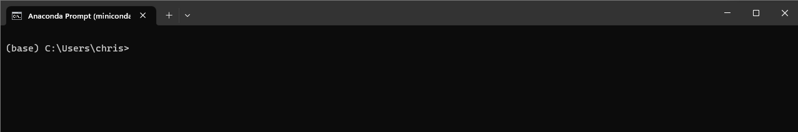
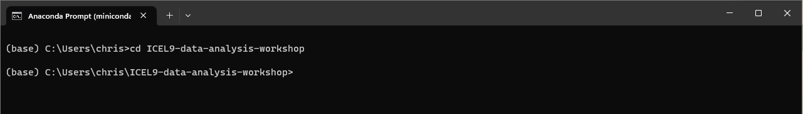
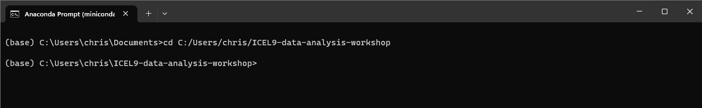
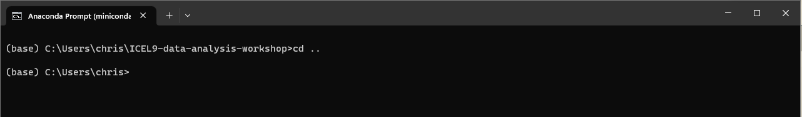
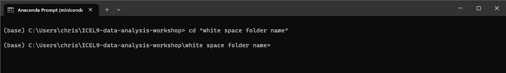
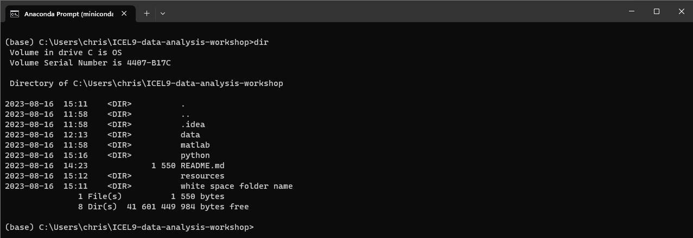

# Basic command line and terminal guide

You have probably both seen and heard about the command prompt (windows) and the terminal (macOS and linux). These tools 
can be described as a text based user interfaces, where instead of clicking images/folder etc., you navigate and 
execute commands using written text.

For the purpose of this workshop there are only two general commands that you need to familiarize yourself with. The 
examples in this guide have been written for windows, but they work more or less the same way on macOS / linux 
(replace `"\"` with `"/"` in the examples below). 

- Windows
  - `cd`  for navigating folders, cs is an abbreviation for change directory
  - `dir` for listing the folders and files in your current directory
- macOs / linux
  - `cd` for navigating folders, cs is an abbreviation for change directory
  - `ls` for listing the folders and files in your current directory

## Changing directory using relative paths
Here is what is looks like when you open a command prompt on windows, 
The text path shown before the `>` character indicate where in the file system we are currently positioned. Now lets try
and navigate to the workshop repo folder. On my computer I know that I put the workshop folder right here in my user 
folder `C:\Users\chris\Icel9-data-analysis-workshop`. Using the `cd` command I can navigate to that folder, 

As the last line indicates we are now located in the ICEL workshop folder.
>**NOTE**  
> You typically do not have to type the entire folder path, after entering a few characters try using the tab key to have 
> auto-completion kick in.

This was an example of changing directory to another directory *relative* to the one we were originally in. in the above 
example, the cd command was simply followed by a folder name. The command works because the 
`Icel9-data-analysis-workshop` folder is located in `C:\Users\chris` folder where we located when calling the command to begin with.

## Changing directory using absolute paths
It is also possible to change directory directly to another folder that is not a subfolder of where you are currently 
located. Look at the following example, 
As you can see, suppliying an *absolute* path can take us directly from the `Documents` folder to the 
`Icel9-data-analysis-workshop` folder.

## Going "back" in the folder hierarchy 
Sometimes you just want to go "up" to the parent folder of where you, without using absolute paths. There is a nice
shortcut for this, `cd ..`, 
Changing directory to `..` brings you back to the parent folder of where you were located.

## Navigating to folders with whitespace in their name
So far all folder names in the examples have been without any spaces in them. Whitspace on the command line / terminal 
is however interpreted a little bit differently, so i you want to navigate to a path that has whitespace in its name, 
the entire path name has to be enclosed in double quotes (`"`). Fore example, 
Notice how `white space folder` was enclosed in double quotes when calling the `cd` command.

## Listing what folders actually exist 
It is often difficult to remember all your folders and files on your computer and how they are organized. To help you 
know where you are and where you might want to navigate you can use the `dir` command (`ls` in the macOS and linux terminal),

Note the `..` folder indicating the parent folder. Similarly, the `.` folder indicates the current folder. 