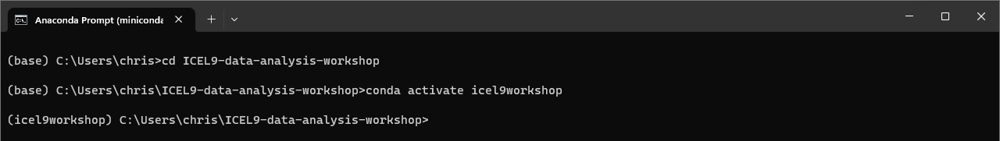
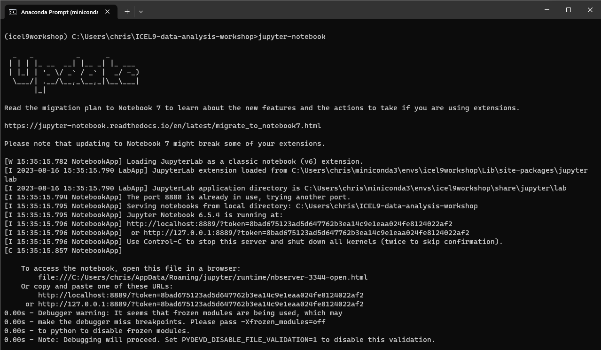
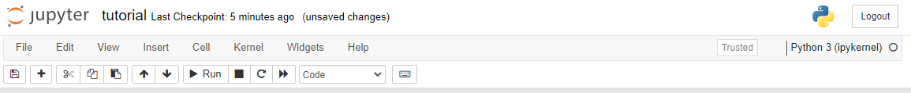
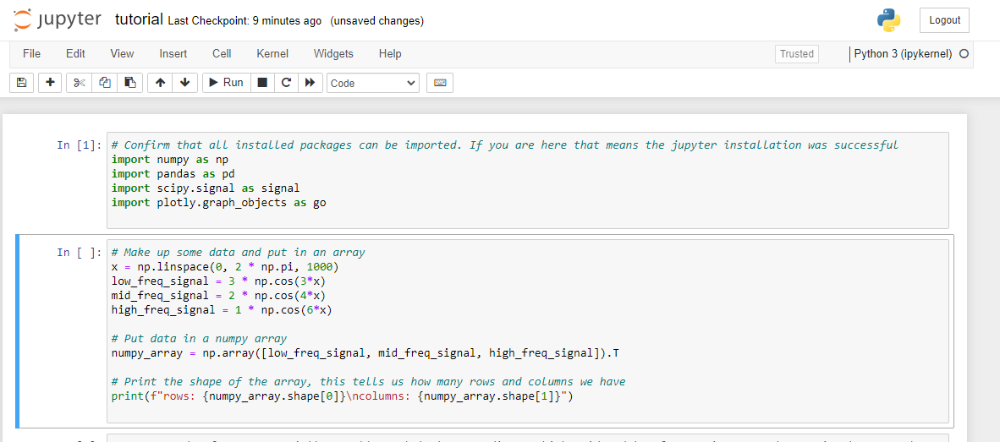

# Python and jupyter notebook tutorial
This tutorial will take you through what you need to know so that you can follow along with the final workshop content. 
It has been designed so that you can run it on your own and test/verify that the installation works as intended. The tutorial
will also attempt to give some basic insight into the components and tools that are used during the workshop.

Typically, when developing and writing code you use a text editor or and *IDE* (Integrated Development Environment). In 
this workshop and tutorial we are going to use a software called jupyter notebook. It is not really a text editor, 
though it has text editor capabilities, neither is it a fully fledged IDE. It can however but used to both write code
and at the same time visualise the results in a way that is quite good for data exploration and sharing purposes. You 
can read more [here](https://jupyter-notebook-beginner-guide.readthedocs.io/en/latest/what_is_jupyter.html).

## Requirements
Before starting this tutorial make sure that you have gone through the installation process [here](README.md) 
(or have an equivalent installation).

Additionally, you need to have a copy of the workshop repository on your computer.

From this moment on it is expected that you have basic knowledge of a few commandline/terminal commands so that you can 
navigate to your local folders where this repository is stored. Please refer to the 
[basic command line guide](basic_command_line_guide.md) if you need it.

## Navigate to the repository and activate our conda environment
Use the *Anaconda prompt* to navigate to where you have your local version of this repository, once there activate 
the environment that was created in [installation guide](./README.md#creating-an-environment-for-our-workshop),

## Start the jupyter notebook service
Execute the jupyter notebook command `jupyter-notebook`. This command is now available to us because we installed it in 
our conda environment. A webpage should open and the command line/ terminal should show you something similar to this,

As you can see no new prompt for you to write commands to has shown up after starting then notebook. This is beacuse the
jupyter notebook is hosted by the process running in you terminal. 
>**NOTE**  
> To get back control over your command line / terminal, and stop the jupyter notebook service you can use `ctrl+c`.

## Start the tutorial notebook 
In the browser page that just opened you should find the contents of the repository listed. You are now inside the jupyter 
notebook application, and we can execute and run *notebooks*. In the browser click the `python` folder and then the 
`tutorial.ipynb` that shows up on the next page.

## The controls of a jupyter notebook
Notebooks are organized into *cells* of code. Each cell can be executed by itself and has access to all the output from 
cells that have been executed before, no matter in what order the actual cells come. To run the code in a cell have a 
look at the menu available at the top of the page, 
Note the "run" button. Clicking this will execute the currently selected cell and also shift to focus to the next cell 
in order. 

## Executing code in a cell
Now click the first cell and (containing the import statements) and then click the run button, the output
should look something like this, 
Note how the empty squared brackets first held and asterisk that then turned into a "1". This indicates the order in 
which the cells have been run.

# Running all cells from the top
In the top menu there is a button that looks like a "fast-forward" button. Clicking this will reset and then run all 
cells from the top down. Click this button now and verify that the all cells have been executed properly without errors.

# Resetting and clearing output
When clicking the "kernel" menu item there is an option to "Restart & clear output". This can sometimes be useful when
old data is lying around somewhere interfering with results.